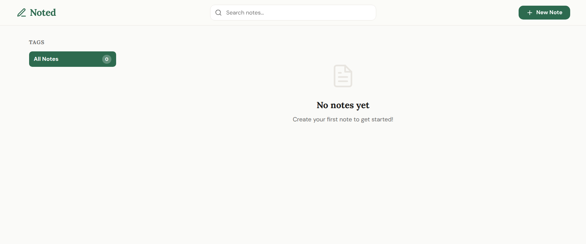
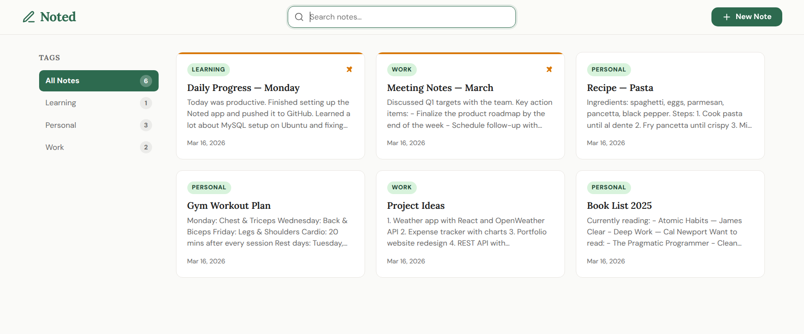
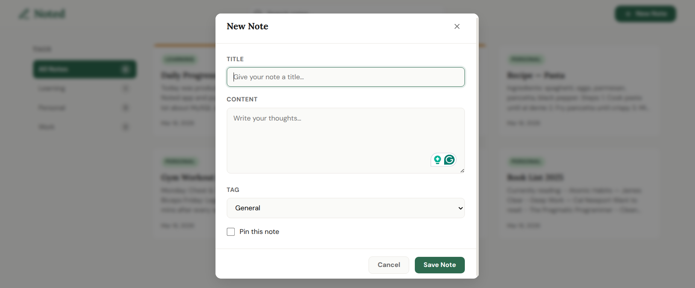
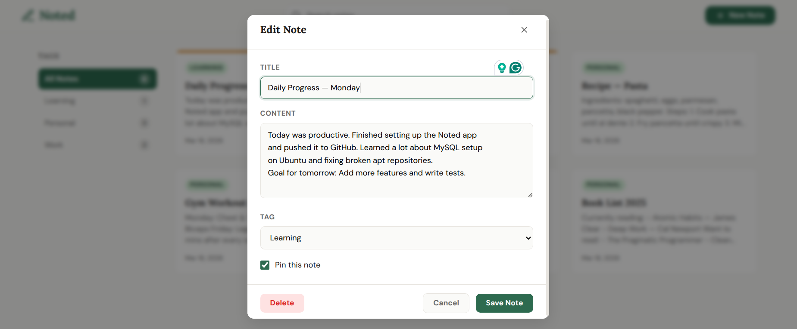
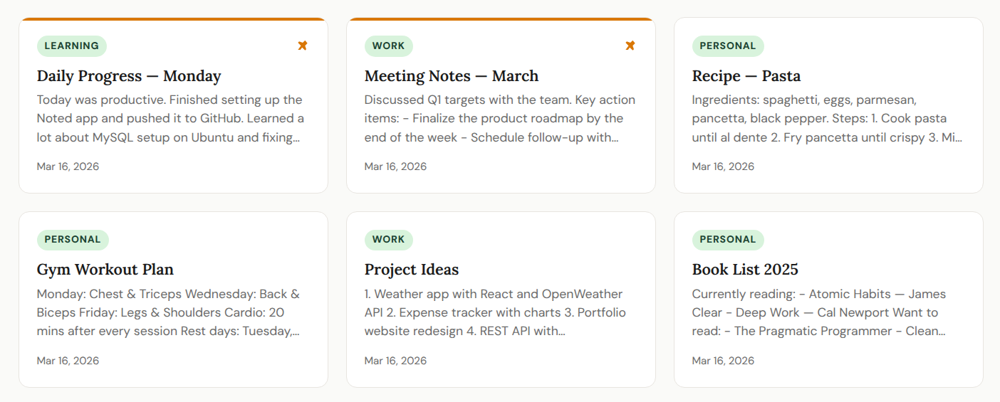
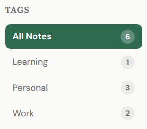
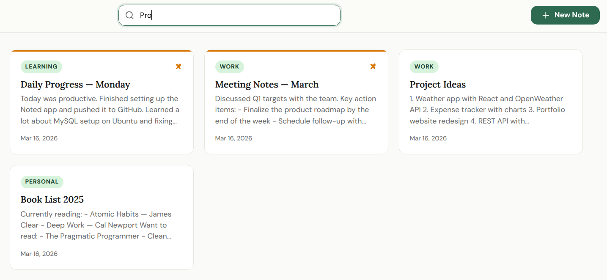

# 📓 Noted — Notes & Journal App

A clean, full-stack Notes and Journal web application built with **Node.js**, **Express**, and **MySQL**. Create, organize, pin, tag, and search your notes — all from a beautiful single-page interface.

---

## 🚀 Features

- 🎨 Clean, responsive frontend served directly by the backend


- 📝 Create, edit, and delete notes


- 📌 Pin important notes to the top

- 🏷️ Tag notes for easy organization

- 🔍 Search notes by title or content


---

## 🛠️ Tech Stack

| Layer | Technology |
|---|---|
| Runtime | Node.js ≥ 18 |
| Framework | Express.js |
| Database | MySQL 8 |
| ORM/Driver | mysql2 |
| Security | Helmet.js, CORS |
| Logging | Morgan |
| Frontend | Vanilla HTML, CSS, JavaScript |

---

## 📁 Project Structure

```
noted-app/
├── src/
│   ├── server.js                  # App entry point
│   ├── config/
│   │   └── db.js                  # MySQL pool & DB bootstrap
│   ├── routes/
│   │   └── notes.routes.js        # Route definitions
│   ├── controllers/
│   │   └── notes.controller.js    # Business logic
│   └── public/
│       └── index.html             # Frontend SPA
├── .env.example                   # Environment variable template
├── .gitignore
├── package.json
└── package-lock.json
```

---

## ⚙️ Getting Started

### Prerequisites

- [Node.js](https://nodejs.org/) v18 or higher
- [MySQL](https://www.mysql.com/) 8 or higher

### 1. Clone the repository

```bash
git clone https://github.com/Nev-007/noted-app.git
cd noted-app
```

### 2. Install dependencies

```bash
npm install
```

### 3. Configure environment variables

Copy the example env file and fill in your values:

```bash
cp .env.example .env
```

Edit `.env`:

```env
PORT=5000
DB_HOST=localhost
DB_PORT=3306
DB_USER=root
DB_PASSWORD=your_mysql_password
DB_NAME=noted_db
```

### 4. Start MySQL

```bash
sudo systemctl start mysql
```

### 5. Run the app

```bash
# Production
npm start

# Development (auto-restart on file changes)
npm run dev
```

The app will be available at **http://localhost:5000**

> The database and `notes` table are created automatically on first boot — no manual SQL setup required.

---

## 📡 API Reference

Base URL: `/api`

| Method | Endpoint | Description |
|---|---|---|
| `GET` | `/health` | Health check |
| `GET` | `/notes` | Get all notes |
| `GET` | `/notes/:id` | Get a note by ID |
| `POST` | `/notes` | Create a new note |
| `PUT` | `/notes/:id` | Update a note |
| `DELETE` | `/notes/:id` | Delete a note |
| `PATCH` | `/notes/:id/pin` | Toggle pin on a note |

### Query Parameters for `GET /notes`

| Parameter | Type | Description |
|---|---|---|
| `search` | string | Search by title or content |
| `tag` | string | Filter by tag |
| `pinned` | 0 or 1 | Filter by pinned status |

### Request Body for `POST` / `PUT`

```json
{
  "title": "My Note",
  "content": "Note content here",
  "tag": "personal",
  "pinned": false
}
```

### Response Format

All responses follow this structure:

```json
{
  "success": true,
  "data": { ... }
}
```

---

## 🗄️ Database Schema

```sql
CREATE TABLE notes (
  id         INT AUTO_INCREMENT PRIMARY KEY,
  title      VARCHAR(200) NOT NULL,
  content    TEXT NOT NULL,
  tag        VARCHAR(50) DEFAULT 'general',
  pinned     TINYINT(1) DEFAULT 0,
  created_at DATETIME DEFAULT CURRENT_TIMESTAMP,
  updated_at DATETIME DEFAULT CURRENT_TIMESTAMP ON UPDATE CURRENT_TIMESTAMP
);
```

---

> Built with ❤️ by [Nev-007](https://github.com/Nev-007)
